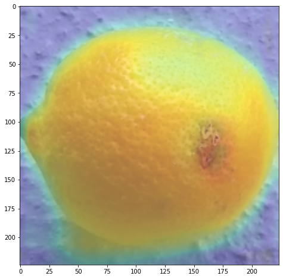

<h1  align=center>Lemon Quality Classification with Class Activation Map</h1>

 

<small>Picture Source:<a  href="https://cdn.britannica.com/84/188484-050-F27B0049/lemons-tree.jpg"> britannica</a>

  

<h2>Description</h2>

Lemon dataset has been prepared to investigate the possibilities to tackle the issue of fruit quality control. It contains <i>2.533</i> images <i>(300 x 300 pixels)</i>. Lemon images are taken on a concrete surface. Dataset also includes empty images of this surface.  

Dataset contains images of both bad and good quality lemons under slightly different lighting conditions (all under daylight) and sizes.

<b>Within the scope of this project, a classification model was builded whether lemons have good quality, bad quality or empty through data.</b>The results of the model on the test data are in the <a  href="https://github.com/doguilmak/Lemon-Quality-Classification-with-CAM/blob/main/model_predictions.csv">model_predictions.csv</a> excel file. Just click the link to view.

 

<h2>Acknowledgements</h2>

This dataset has been referred from <a  href="https://www.kaggle.com/datasets/yusufemir/lemon-quality-dataset">Kaggle</a>.

 

<h2>Objective:</h2>

<ul>
	<li>Understand the dataset & cleanup (if required).</li>
	<li>Build classification models to predict the lemon class.</li>
	<li>Also fine-tune the hyperparameters & compare the evaluation metrics of various classification algorithms.</li>
	<li>Build class activation maps (CAM).</li>
</ul>

 

<h2>Keywords</h2>

<ul>
	<li>Computer Science</li>
	<li>Classification</li>
	<li>Biology</li>
	<li>Class Activation Map</li>
	<li>Neural Networks</li>
	<li>Lemons</li>
</ul>

<h2>Prediction with Class Activation Map (CAM)</h2>

Output

<small>Bad quality: 0.3771207928657532</small> 

<small>Empty: 0.3149782419204712</small> 

<small>Good quality: 0.30790096521377563</small>

 

<h2>Dataset License</h2>

<a  href="https://creativecommons.org/publicdomain/zero/1.0/">CC0: Public Domain</a>

<i>Putting a database or dataset in the _public domain_ under _CC0_ is a way to remove any legal doubt about whether researchers can use the data in their projects.</i>

<h1>Contact Me</h1>

If you have something to say to me please contact me:

<ul>
	<li>Twitter: <a  href="https://twitter.com/Doguilmak">Doguilmak</a></li>
	<li>Mail address: doguilmak@gmail.com</li>
</ul>
